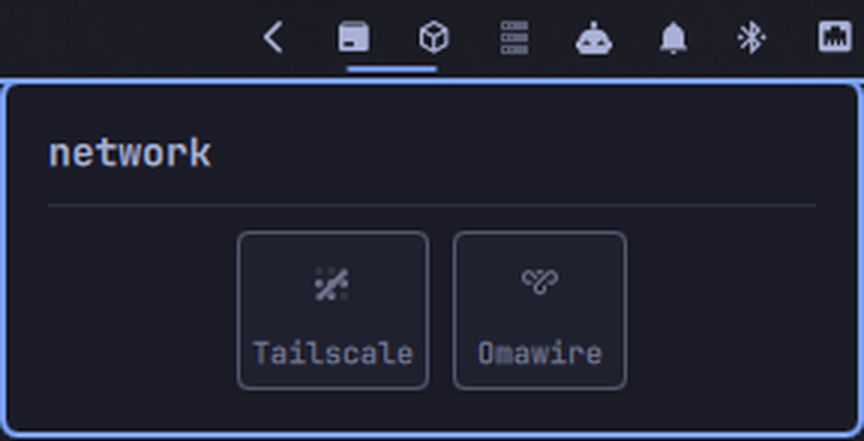

# Plugin containers

Group bar widgets into named containers so the Omarchy bar stops filling up.

A container is one icon in the bar. Click it and the plugins inside it appear
in a strip below, fully interactive — the same widgets, with the same menus and
the same settings, just somewhere else. Nothing about a plugin changes when it
goes into a container; it simply stops taking up a slot in the bar.



## Using it

The box icon is always in the bar, whether or not you have any containers.
Click it to open the container manager.

- **New container** creates one. Give it a name and pick an icon. Only the icon
  goes in the bar — that is what keeps a container to a single slot however
  long its name is — so pick a distinct one; the name is its tooltip.
- Select a container on the left, then add plugins to it on the right. Drag a
  plugin from the catalogue onto the container's list, or press its **+**.
- The catalogue lists every installed plugin that has a bar widget, including
  ones you have switched off. A plugin can be in more than one container.
- Inside an open container the whole cell is the plugin's button — its icon,
  its name and the space around them all activate it.
- Reorder a container's plugins by dragging them; reorder the containers
  themselves with the up and down buttons, which is the order they appear in
  the bar.
- **×** takes a plugin out of a container. It does not uninstall or disable
  anything: the plugin goes back to the bar in the position it had before,
  or stays off the bar if that is where it was.
- Deleting a container puts everything it held back the same way.

Right-clicking a container button opens the manager; right-clicking the box
closes whatever is open.

### What it does to your bar

Putting a plugin in a container removes its entry from `bar.layout` in
`~/.config/omarchy/shell.json`, and the container remembers where it was and
what its settings were. That is what makes it disappear from the bar, and it is
why `omarchy plugin list` reports a contained plugin as disabled. Taking it out
of the container writes the entry back.

Because that record lives in this plugin's own settings, **empty your
containers before uninstalling** — see [Uninstall](#uninstall).

## Requirements

Omarchy 4 with the Quickshell bar. Nothing else: no daemons, no network access,
no additional packages.

## Install

```bash
omarchy plugin add https://github.com/Leyanora/omarchy-plugin-containers.git --enable
```

If you skipped `--enable`, place it yourself:

```bash
omarchy plugin enable leyanora.plugincontainers --section right
```

## Update

```bash
omarchy plugin update leyanora.plugincontainers
omarchy restart shell
```

## Uninstall

Put your plugins back on the bar first. Removing the plugin deletes its entry
from `shell.json`, and that entry is the only record of where each contained
plugin belongs — without this step they stay off the bar and you have to place
them again by hand.

```bash
omarchy-shell leyanora.plugincontainers restoreAll
omarchy plugin remove leyanora.plugincontainers
```

## Settings

There is nothing to configure. The plugin stores its state inline on its own
bar entry in `~/.config/omarchy/shell.json`:

| Key | What it holds |
| --- | --- |
| `containers` | The containers, in bar order: `id`, `name`, `icon`, and the `members` list of plugin ids |
| `stashed` | Per plugin, the bar position and settings it had before a container claimed it, so removing it can put it back |

Editing these by hand works — the plugin reconciles whatever it finds — but the
manager is easier.

## IPC

```bash
omarchy-shell leyanora.plugincontainers manage              # open the container manager
omarchy-shell leyanora.plugincontainers openContainer NAME  # open a container by name
omarchy-shell leyanora.plugincontainers toggle              # open/close
omarchy-shell leyanora.plugincontainers close
omarchy-shell leyanora.plugincontainers restoreAll          # empty every container, put every plugin back
omarchy-shell leyanora.plugincontainers refresh             # re-check the model against the bar
```

## What it touches

Only `~/.config/omarchy/shell.json`, through the shell's own atomic-write
helpers. No other files, no commands, no subprocesses, no network requests, no
privileged operations.

Contained plugins are ordinary Omarchy plugins running unchanged — this plugin
does not sandbox them, and they keep whatever access they already had.

## License

MIT — see [LICENSE](LICENSE).
